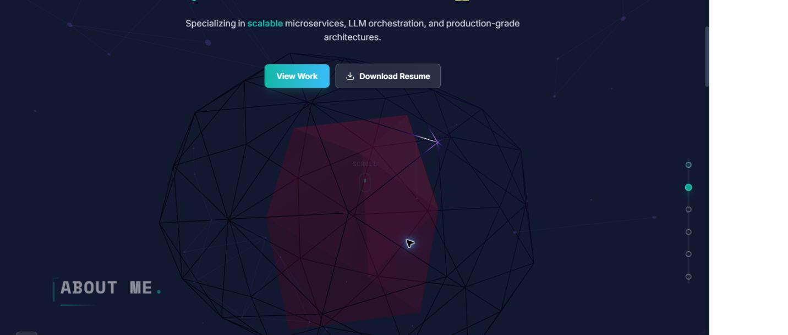

# Kowsalya Saravanan Portfolio

Professional portfolio for Kowsalya Saravanan, focused on AI, ML, backend engineering, scalable microservices, LLM orchestration, and production-ready systems.

## Live Demo

**Portfolio:** [https://kowsalya-saravanan.vercel.app](https://kowsalya-saravanan.vercel.app)

## Preview



## Highlights

- Clean, responsive React portfolio
- Professional AI, ML, and backend engineering positioning
- Polished project, skills, experience, and contact sections
- Vercel production deployment
- Resume download included at `/Kowsalya_Saravanan_AI_ML.pdf`
- Static content source, no backend API required

## Tech Stack

- React 19
- TypeScript
- Vite
- Tailwind CSS
- Framer Motion
- Three.js / React Three Fiber
- Lucide React

## Run Locally

```bash
npm install
npm run dev
```

Local site:

```text
http://localhost:3000
```

## Build

```bash
npm run build
```

The production build outputs to `dist/`.

## Deployment

This portfolio is deployed on Vercel from the GitHub `main` branch.

Current production URL:

[https://kowsalya-saravanan.vercel.app](https://kowsalya-saravanan.vercel.app)

## Contact

- Email: [kowsi143rc@gmail.com](mailto:kowsi143rc@gmail.com)
- LinkedIn: [linkedin.com/in/kowsalya-saravanan-709a45258](https://www.linkedin.com/in/kowsalya-saravanan-709a45258)
- Phone: +91 9025417742
